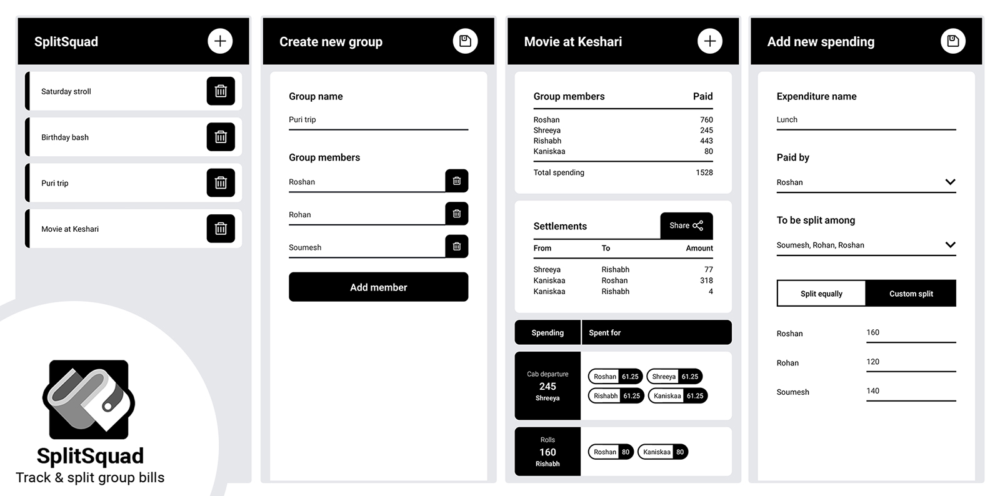

# SplitSquad

**Track & split group bills with ease** 💵😎

[](https://github.com/dashroshan/SplitSquad/releases/latest)



No more fussing with change, misplaced receipts, or arguments about your group's expenditures. Simply enter your spending, and SplitSquad will show you who owes how much to whom. Ideal for vacations, house sharing, trips, and organizing large parties or events with multiple people.

The best part? SplitSquad works completely offline. Create an offline group and have control over splitting costs in seconds. It's simple, and no sign-up is required. Divide equally among selected members or create a unique split. SplitSquad allows you to swiftly and simply split even the most difficult bills.

Find the best possible way to settle up your payments with minimum transactions among your squad. Avoid the awkwardness of asking for pending payments from friends and send them an image with all the details.

Easy!


## Setup and build instructions

### Install packages

```
npm i
```

### Run on expo

```
npx expo start
```

### Build APK

1. `npx expo-doctor` to check if everything is alright, then `npx expo prebuild` to create/update the android folder.
2. Generate keystore file with:

```
keytool -genkey -v -keystore your_key_name.keystore -alias your_key_alias -keyalg RSA -keysize 2048 -validity 10000
```

3. Put the keystore file inside `android/app` folder.
4. Add below inside `signingConfigs` of `android/app/build.gradle` file:

```
release {
    storeFile file('your_key_name.keystore')
    storePassword 'password'
    keyAlias 'your_key_alias'
    keyPassword 'password'
}
```

5. Modify buildTypes → release of `android/app/build.gradle` file to:

```
release {
    signingConfig signingConfigs.release
    shrinkResources true
    minifyEnabled true
    proguardFiles getDefaultProguardFile("proguard-android.txt"), "proguard-rules.pro"
}
```

6. Add below code between signingConfigs and buildTypes:

```
splits {
    abi {
        reset()
        enable true
        universalApk true
        include "armeabi-v7a", "x86", "arm64-v8a", "x86-64"
    }
}
```

7. `./gradlew assembleRelease` in the android folder.

APK will be generated in `android\app\build\outputs\apk\release`